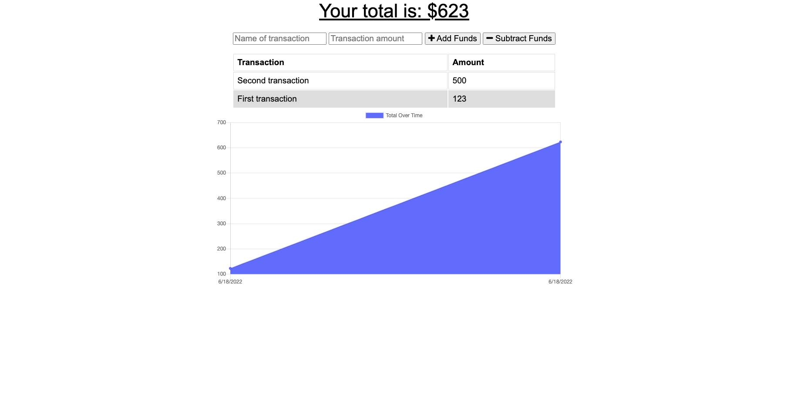

# Budget Tracker Starter Code

This project is a simple budget tracker. It has offline functionality using IndexedDB to save transaction data to the browser, which sends the data to a Mongo database when connection is restored. It additionally operates as a downloadable PWA, using a manifest.json and a simple service worker to cache important files.

## Screenshots

## Technologies

## Installation and start up

1. To install, `git clone` the repository and run `npm install` to install dependencies.

2. You must have MongoDB installed on your computer to run this application.

3. `npm start` will open a database connection and start the server, which can then be accessed in the browser at the appropriate host.

## Live Link

The app is also viewable [here](https://pacific-reef-94273.herokuapp.com/).
